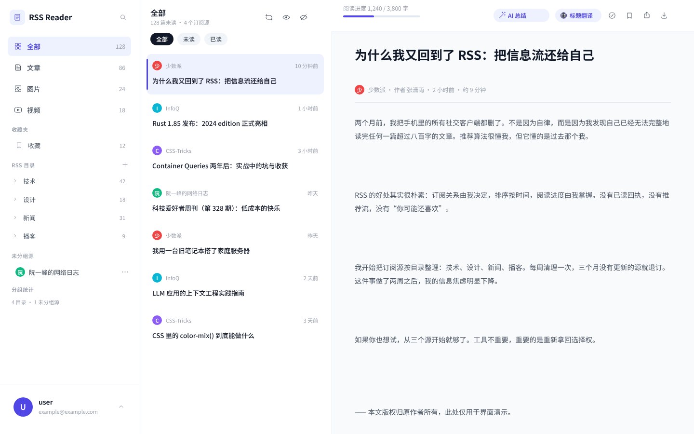
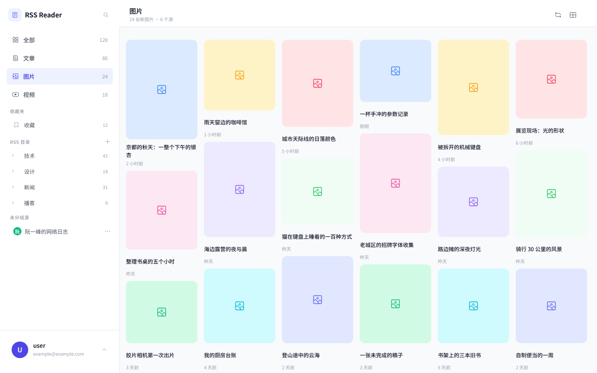
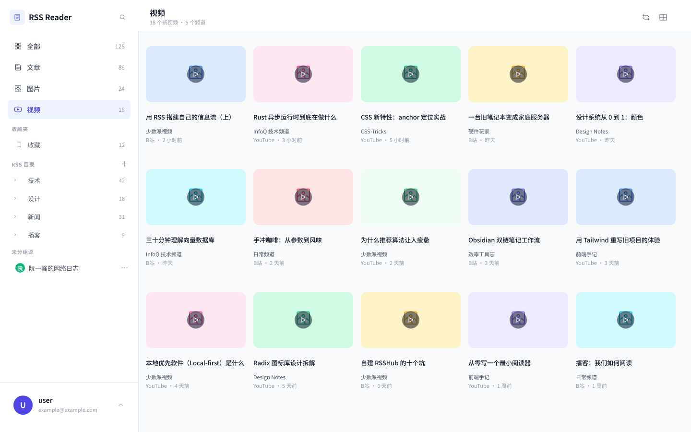
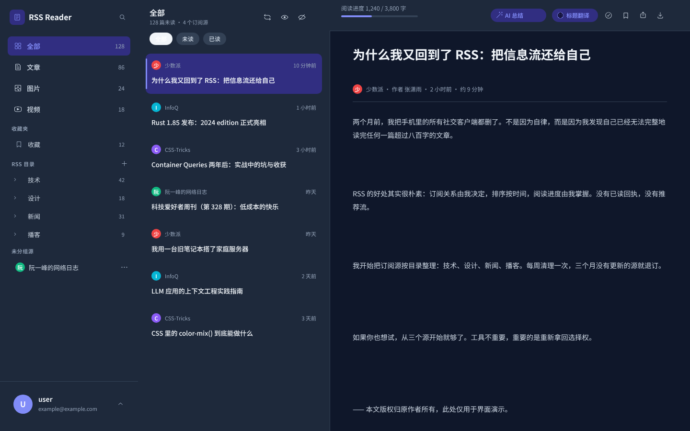
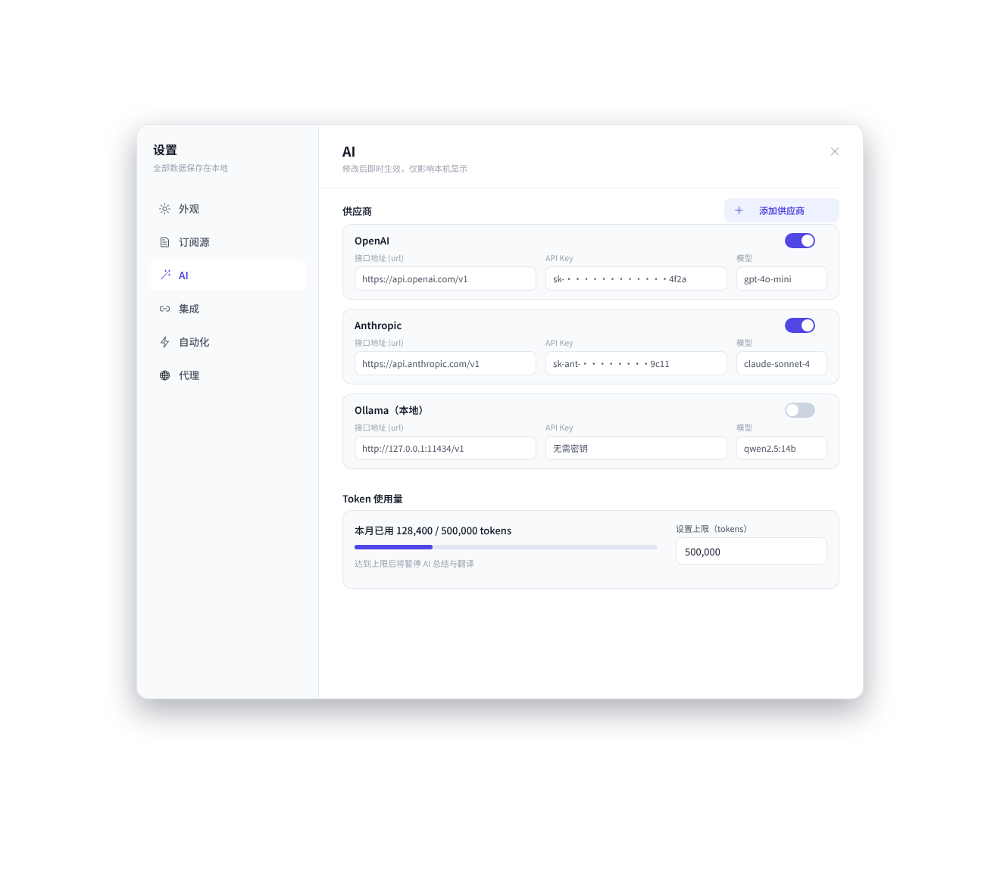

# rss-tool

[](https://github.com/Sw-Kan/rss-tool/actions/workflows/ci.yml)

自托管的 RSS 阅读器：**文章、图片、视频在同一个时间线里读，数据全在自己的机器上。**



| 图片：六列瀑布流 | 视频：封面网格 |
|---|---|
|  |  |
| **深色主题** | **设置：AI 供应商** |
|  |  |

*界面预览（源自 `docs/design-system.md` 的 Penpot 设计稿）*

## 它和别的阅读器差在哪

现成的阅读器基本只认文章，图片和视频混在同一个列表里。rss-tool 按内容类型分成两种阅读形态：

- **文章**：左边列表、右边正文，读完点「下一条」自动标已读；
- **图片**：6 列瀑布流，按图片真实比例排，一屏能扫很多张；
- **视频**：5 列封面网格，点开是灯箱详情，封面 + 播放按钮直接开原站。

收藏是**可以和类型叠加**的：点「视频」再点「收藏」，看的就是收藏夹里的视频；换回「图片」就是收藏的图片。

## 功能

**读**
- 三种形态 + 图片/视频的灯箱详情（`Esc` / 点遮罩 / 点 × 关闭，`item=` 进 URL，刷新和后退都对）
- 已读 / 未读 / 收藏、按目录或源筛选、侧边栏就地过滤目录与源名
- 深浅色主题、中文 / English 切换

**订阅**
- 目录 / 源两级；**源可以长按拖到别的目录**（也可以拖回「未分组」）
- OPML 导入导出；添加订阅时填 RSSHub 裸路由（如 `/sspai/matrix`）会自动展开成完整地址

**把内容读完整**
- feed 只给短摘要时，自动去原网页抽正文；抽到的正文**不会被下一轮刷新覆盖**
- AI 总结与标题翻译：**边生成边显示**；配了多家供应商时自动重试、失败切换下一家
- 外链图经本地缓存代理，绕开防盗链；按磁盘预算自动清理

**让它自己动**
- 自动化：`新条目 / 新视频 / 新图片 / 定时` 触发 → 条件（标题、字数、频道、源、类型、已读、收藏，可 且/或 组合）→ 动作（标已读、收藏、飞书推送、写入 Obsidian、推自定义接口）
- 自建 RSSHub：填地址 + 访问密钥 + 测试连接

## 快速开始

Docker（最省事）：

```bash
docker compose up -d --build     # http://localhost:8080
```

本地开发：

```bash
make setup && make dev           # 前端 http://localhost:5173，后端 http://localhost:8000
```

首次进入点登录页的「跳过，以 user 身份进入」就行。开发需要 Python ≥ 3.11（用 [uv](https://github.com/astral-sh/uv) 装依赖）和 Node 22（`corepack enable` 提供 pnpm）。

配置项都有默认值，两个容易踩的：

- 要订阅**自建 RSSHub 或局域网 feed**，得在 `.env` 里设 `ALLOW_PRIVATE_FETCH=true`（默认关，防 SSRF）；
- Docker 里**记得设 `TZ`**，否则自动化里的「每天早上 8 点」会差几个小时。

其余环境变量见 `.env.example`。AI 供应商、集成、代理不在环境变量里 —— 它们在「设置」弹窗里填，存在本地数据库。

## 技术栈

React 19 · TypeScript · Vite · Tailwind v4 · Radix · TanStack Query ｜ FastAPI · SQLAlchemy 2.0 · SQLite · APScheduler ｜ pytest · vitest

## 开发

```bash
make test        # 后端 pytest + 前端 vitest
make lint        # ruff + eslint
make typecheck   # tsc --noEmit
make help        # 全部命令
```

`make lint && make typecheck && make test` 通过才算完成。开发规范（模块边界、写权限、代码风格、已知限制）以 `AGENTS.md` 为准，其余文档在 `docs/`：

| 文件 | 内容 |
|---|---|
| `docs/architecture.md` | 进程拓扑、分层、抓取 / 抽取 / AI / 自动化 / 代理 / 媒体管线 |
| `docs/data-model.md` · `docs/api.md` | 表结构 · 接口契约 |
| `docs/design-system.md` | 设计令牌与组件清单（源自 Penpot 设计稿） |
| `docs/development.md` | 调试技巧与手工验收清单 |
| `docs/roadmap.md` · `pages.md` | 已划边界未实现的功能 · 原始需求 |

项目**没有数据库迁移**：改表结构就直接 `make db-reset` 删库重建（本地单实例，数据随时能重新抓）。

## License

MIT，见 `LICENSE`。
